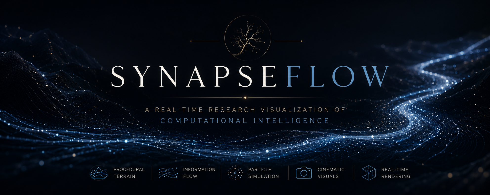
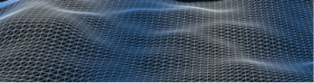
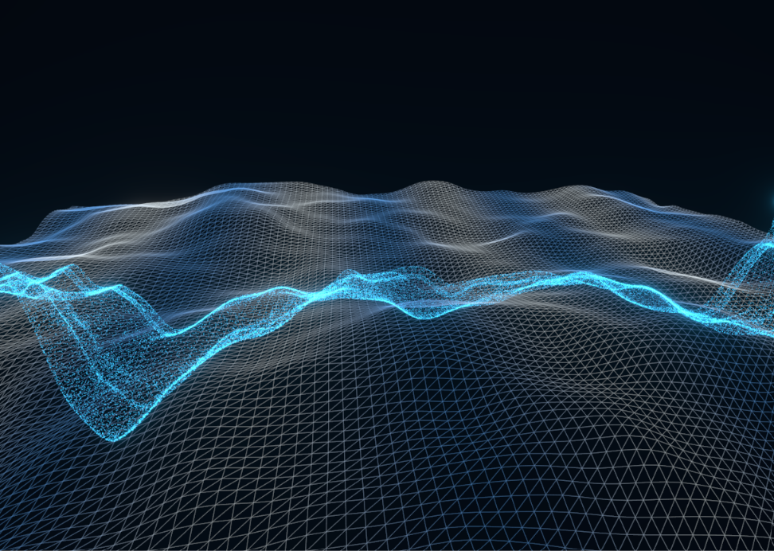
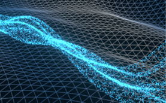
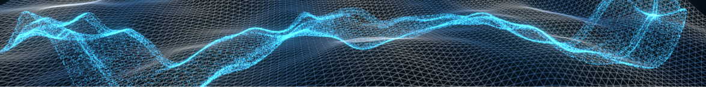

<p align="center">
  
</p>

<div align="center">

# 🌌 SynapseFlow

### A Real-Time Research Visualization of Computational Intelligence

> *Exploring how information might propagate through a dynamic computational landscape.*


</div>

---

# Overview

SynapseFlow is an experimental real-time visualization exploring how complex computational systems can be represented through motion instead of static diagrams.

Rather than visualizing information as isolated nodes or fixed connections, this project investigates continuous information flow across a procedural computational landscape where thousands of simple computational elements collectively form evolving patterns.

The objective is **not** to simulate biological intelligence. Instead, SynapseFlow explores how modern computer graphics can provide a more intuitive visual language for understanding distributed computation, emergence, and information propagation.

---

# Demo

<p align="center">

</p>

---

# Inspiration

Most intelligent systems are explained through equations, graphs, and network diagrams.

SynapseFlow asks a different question.

> **What if computation could be experienced rather than simply observed?**

Instead of presenting information through traditional visualizations, this project explores how movement, procedural environments, and collective particle behavior can communicate abstract computational ideas in a more intuitive way.

---

# Features

- Procedural terrain generation using layered Simplex Noise
- Dynamic spline-based information flow
- Modular particle simulation engine
- Real-time rendering with React Three Fiber
- Cinematic camera movement
- Shader-ready rendering architecture
- Research-oriented visualization pipeline
- GPU-ready project architecture

---

# Gallery

## Computational Landscape

> Procedurally generated terrain representing a dynamic computational state space.

<p align="center">

</p>

---

## Information Flow

> Thousands of particles collectively forming a continuous computational stream.

<p align="center">

</p>

---

## Particle Simulation

> Close-up view of the real-time particle system.

<p align="center">

</p>

---

## Flow Structure

> Top-down visualization of the spline-driven flow engine.

<p align="center">

</p>

---

# Architecture

```text
                 SYNAPSEFLOW

     Computational Visualization Engine


         React Three Fiber
                 │
      ┌──────────┴──────────┐
      ▼                     ▼
 Terrain Engine      Particle Engine
      │                     │
      ▼                     ▼
 Procedural Noise     Flow Simulation
      └──────────┬──────────┘
                 ▼
        Rendering Pipeline
                 ▼
            GPU Ready
```

---

# How It Works

## Procedural Terrain

The landscape is generated using layered Simplex Noise to create a computational environment rather than a realistic terrain.

---

## Flow Engine

Particles move along spline-generated paths that continuously evolve throughout the simulation.

---

## Particle Engine

The particle system separates simulation from rendering, creating a modular architecture that is scalable and prepared for future GPU acceleration.

---

## Rendering

The visualization is built with React Three Fiber and Three.js while progressively transitioning toward custom GLSL shaders for advanced rendering.

---

# Project Structure

```text
SynapseFlow/
│
├── assets/
│   ├── banner.png
│   ├── demo.gif
│   ├── overview.png
│   ├── terrain.png
│   ├── closeup.png
│   ├── topview.png
│
├── public/
│
├── src/
│   ├── components/
│   │   ├── CameraRig.jsx
│   │   ├── FlowField.jsx
│   │   ├── Lights.jsx
│   │   ├── NetworkSurface.jsx
│   │
│   ├── shaders/
│   │   ├── particleVertex.glsl
│   │   ├── particleFragment.glsl
│   │   ├── terrainVertex.glsl
│   │   └── terrainFragment.glsl
│   │
│   ├── utils/
│   │   ├── flow.js
│   │   ├── noise.js
│   │   └── particles.js
│   │
│   ├── App.jsx
│   └── main.jsx
│
├── package.json
└── README.md
```

---

# Technology Stack

| Category | Technologies |
|----------|--------------|
| Frontend | React, Vite |
| Graphics | Three.js, React Three Fiber |
| Rendering | WebGL, GLSL *(In Progress)* |
| Simulation | JavaScript |
| Terrain | Simplex Noise |
| Version Control | Git & GitHub |

---

# Why This Project?

SynapseFlow began with a simple idea.

> **Could complex computational systems be represented through motion rather than static diagrams?**

Instead of treating information as isolated nodes, this project explores continuous computational flow as a visual metaphor for distributed systems.

Rather than presenting a finished scientific model, SynapseFlow serves as an experimental graphics platform for investigating new approaches to scientific visualization.

---

# Roadmap

## ✅ Completed

- Procedural terrain generation
- Particle simulation engine
- Spline-based flow system
- Modular rendering architecture
- Research visualization prototype
- LinkedIn project showcase

---

## 🚧 Currently In Progress

- Custom GLSL particle shaders
- Terrain shaders
- Improved rendering pipeline
- Interactive controls
- Information pulse visualization

---

## 🔮 Future Plans

- GPU particle simulation
- Emergent collective behavior
- Interactive research mode
- Adaptive flow fields
- Real-time parameter controls
- Web deployment

---

# Installation

Clone the repository

```bash
git clone https://github.com/YOUR_USERNAME/SnapsFlow.git
```

Navigate into the project

```bash
cd SnapsFlow
```

Install dependencies

```bash
npm install
```

Run the development server

```bash
npm run dev
```

---

# Future Vision

SynapseFlow is being developed as an experimental visualization platform that combines computer graphics with concepts inspired by distributed computation.

Future versions will explore GPU-driven particle systems, interactive visualization tools, emergent behaviors, and new techniques for communicating computational processes through motion.

---

# Author

## Ashie Sharma

**B.Tech Computer Science (Artificial Intelligence & Machine Learning)**

Exploring the intersection of:

- Artificial Intelligence
- Computer Graphics
- Scientific Visualization
- Human-Computer Interaction

Connect with me on LinkedIn to follow the progress of SynapseFlow and future research visualization projects.

---

<div align="center">

### ⭐ If you found this project interesting, consider giving it a star!

**SynapseFlow** — *Visualizing Computational Intelligence.*

</div>